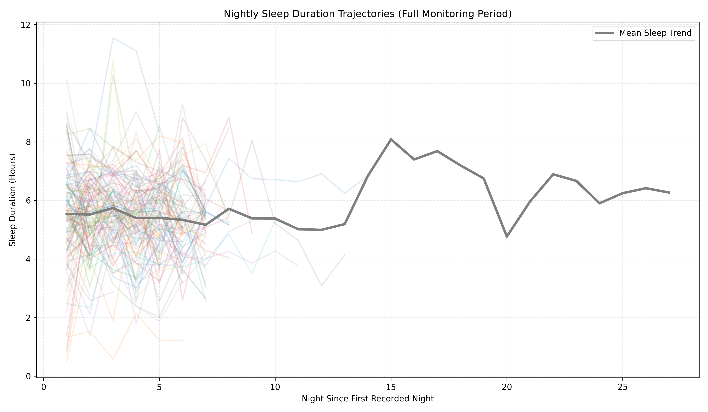
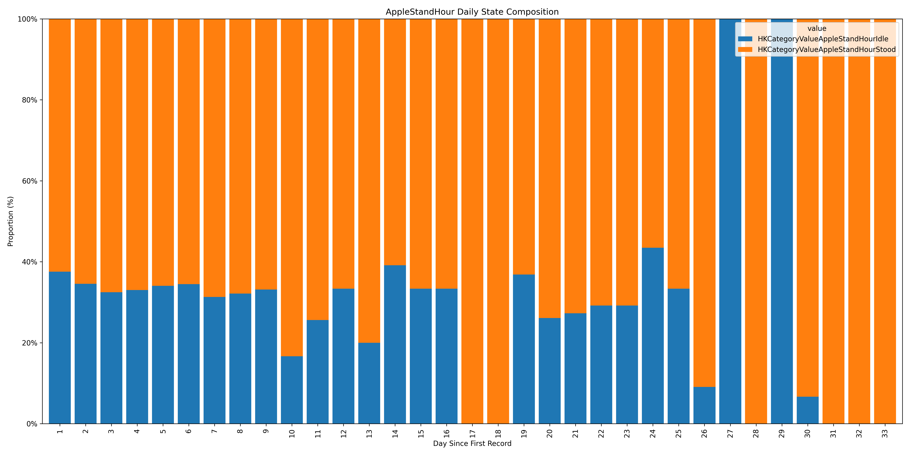
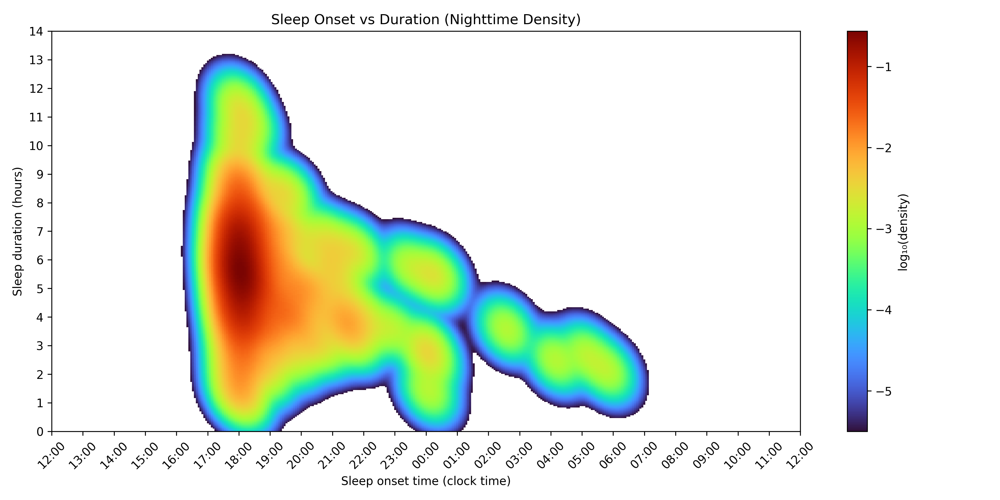

# Build Plots with Python

# Introduction

This document explains how to build scientific plots in **Python**.

The objective is to demonstrate how Python can be used to:

- explore longitudinal health data  
- build clear scientific visualizations  
- automate the generation of multiple plots  

The examples presented here come from a wearable data analysis pipeline including variables such as:

- daily steps  
- physiological measurements  
- sleep patterns  

Throughout this document we progressively move from **simple plotting** to **automated plot generation**.

---

# Types of Graphs Generated in this Pipeline

The analysis pipeline generates three main types of figures.

## 1. Individual Trajectories Plot

This plot shows how a variable evolves over time for different participants.

Each thin line represents a participant and the thicker line represents the mean trend.



These plots are commonly used in:

- epidemiology  
- clinical monitoring  
- behavioral research  
- wearable data studies  

They allow researchers to observe both **individual variability** and **population trends**.

---

## 2. Stacked Categorical Proportion Plot

This plot shows the proportion of categorical states across time.



Each bar represents a day and each color represents a state.

Typical examples include:

- activity states  
- sleep stages  
- behavioral categories  

All bars sum to **100% of the observations for that day**.

---

## 3. Sleep Density Heatmap

This visualization shows the relationship between:

- sleep onset time  
- sleep duration  



The color intensity indicates where observations are more concentrated.

Such visualizations are common in:

- sleep science  
- chronobiology  
- digital health research  

---

# Python Libraries for Plotting

Several libraries can be used to create visualizations in Python.

| Library | Description |
|------|------|
| Matplotlib | Core plotting library |
| Seaborn | Statistical visualization built on Matplotlib |
| Plotly | Interactive visualizations |
| Bokeh | Interactive browser-based plotting |
| Altair | Declarative visualization grammar |

In this project we use **Matplotlib**, which is the most fundamental plotting library in Python.

Advantages of Matplotlib:

- very flexible  
- widely used in scientific computing  
- integrates well with pandas  
- suitable for automated pipelines  

---

# Building a Plot for One Participant

Before automating plot generation, it is important to understand how to build a simple graph.

We start with **a single participant**.

## Import Required Libraries

```r
import pandas as pd
import matplotlib.pyplot as plt
```

- **pandas** manages tabular data and allows manipulation of datasets  
- **matplotlib.pyplot** provides functions used to create plots  

---

# Load the Dataset

```r
df = pd.read_excel("steps_data.xlsx")
```

This command loads the dataset into a **DataFrame**, which is the main table structure used in pandas.

Example structure:

| PID | date | steps |
|-----|------|------|
| P01 | 2024-01-01 | 5200 |
| P01 | 2024-01-02 | 6100 |

---

# Select One Participant

```r
participant_data = df[df["PID"] == "P01"]
```

This filters the dataset to keep only observations belonging to **participant P01**.

This helps us understand plotting logic before scaling to multiple participants.

---

# Create the Plot

```r
plt.figure(figsize=(10,6))
```

This creates an empty plotting canvas.

The parameter `figsize` defines the size of the figure.

---

# Draw the Trajectory

```r
plt.plot(
    participant_data["day_index"],
    participant_data["steps"]
)
```

Explanation:

- the **x-axis** represents time (day index)  
- the **y-axis** represents the variable of interest (steps)  

This produces the trajectory of the participant across time.

---

# Customize the Plot

```r
plt.title("Daily Steps for Participant P01")
plt.xlabel("Day since first record")
plt.ylabel("Steps")
plt.grid(True)
```

These commands add:

- a **title**  
- **axis labels**  
- a **grid** to improve readability  

---

# Save the Plot

```r
plt.savefig("single_participant_plot.png", dpi=300)
```

This saves the plot with high resolution.

The parameter `dpi=300` ensures **publication-quality resolution**.

---

# Extending the Plot to Multiple Participants

Once we understand how a single trajectory is plotted, we can extend the graph to multiple participants.

```r
plt.figure(figsize=(12,7))

for pid, g in df.groupby("PID"):

    plt.plot(
        g["day_index"],
        g["steps"],
        alpha=0.2
    )
```

The function `groupby("PID")` splits the dataset into smaller subsets based on the participant identifier (`PID`). Each subset corresponds to the data of one participant.

The loop syntax:

```r
for pid, g in df.groupby("PID"):
```

works as follows:

- `pid` is the **participant identifier** (for example `"P01"`, `"P02"`, etc.).
- `g` is a **temporary DataFrame containing only the rows for that participant**.

In other words, during each iteration of the loop:

- `pid` stores the participant ID
- `g` stores the subset of the data corresponding to that participant

Example:

If the original dataset looks like this:

| PID | day_index | steps |
|-----|----------|------|
| P01 | 1 | 5200 |
| P01 | 2 | 6100 |
| P02 | 1 | 4300 |
| P02 | 2 | 5000 |

then the loop will internally behave like this:

Iteration 1

```r
pid = "P01"
g =
PID  day_index  steps
P01      1      5200
P01      2      6100
```

Iteration 2

```r
pid = "P02"
g =
PID  day_index  steps
P02      1      4300
P02      2      5000
```

The line

```r
plt.plot(
    g["day_index"],
    g["steps"],
    alpha=0.2
)
```

then draws the trajectory of that participant using only the data stored in `g`.

The parameter `alpha=0.2` controls the transparency of the line. Using a low transparency allows many participant trajectories to be displayed simultaneously without making the plot unreadable. 
This allows many trajectories to be visualized simultaneously.

---

# Adding a Mean Trend

To better understand the overall population pattern we can compute a mean trajectory.

```r
mean_trend = df.groupby("day_index")["steps"].mean()

plt.plot(
    mean_trend.index,
    mean_trend.values,
    linewidth=3,
    label="Mean Trend"
)
```

The purpose of this code is to compute and display the **average trajectory across all participants**.  
While the individual lines show each participant’s behavior, this line summarizes the **overall population trend**.

### Step 1 — Compute the mean value per day

```r
mean_trend = df.groupby("day_index")["steps"].mean()
```

Here we use `groupby("day_index")`.

This groups together **all observations that correspond to the same day index** across participants.

For example, if the dataset looks like this:

| PID | day_index | steps |
|-----|----------|------|
| P01 | 1 | 5200 |
| P02 | 1 | 4300 |
| P03 | 1 | 6100 |
| P01 | 2 | 5800 |
| P02 | 2 | 4900 |
| P03 | 2 | 6200 |

Grouping by `day_index` allows us to compute the mean number of steps **for each day across all participants**.

Result:

| day_index | mean_steps |
|----------|-----------|
| 1 | 5200 |
| 2 | 5633 |

The object `mean_trend` is therefore a **Series containing the average value for each day**.

### Step 2 — Plot the mean trajectory

```r
plt.plot(
    mean_trend.index,
    mean_trend.values,
    linewidth=3,
    label="Mean Trend"
)
```
- `mean_trend.index` → represents the **day index** (x-axis)
- `mean_trend.values` → represents the **average number of steps for each day** (y-axis)

Additional parameters:

- `linewidth=3` makes the line thicker so it stands out from the individual trajectories
- `label="Mean Trend"` adds a label that can later appear in the plot legend

### Interpretation

The resulting line represents the **average behavior of the population across time**.

This is useful because:

- individual trajectories can be noisy
- the mean trend highlights the **general pattern shared by participants**
- it helps identify overall increases, decreases, or stable behaviors over time

---

# Creating a Stacked Categorical Plot

Categorical variables require a different visualization approach compared to numerical variables.

In previous sections, we plotted **continuous measurements** such as steps or heart rate. These variables can be averaged or summed and represented as trajectories.

However, some variables represent **states or categories**, for example:

- activity type (walking, running, cycling)
- sleep stage (REM, deep sleep, light sleep)
- posture or behavioral states

Because these variables are **not numeric measurements**, we cannot compute a mean value or a trajectory in the same way. Instead, we are interested in understanding **how the proportion of each category evolves over time**.

A common way to visualize this is with a **stacked bar chart**.

Each bar represents a time unit (for example one day), and the bar is divided into colored segments representing the **proportion of each category**.

For example:

| Day | Walking | Running | Cycling |
|----|----|----|----|
| 1 | 60% | 25% | 15% |
| 2 | 55% | 30% | 15% |
| 3 | 50% | 35% | 15% |

Each bar will therefore sum to **100% of the observations for that day**.

---

## Example Code

```r
prop_wide.plot(
    kind="bar",
    stacked=True,
    figsize=(18,9)
)
```

This command uses the built-in plotting capability of **pandas DataFrames**.

The object `prop_wide` is typically a table where:

- rows represent **time units** (for example `day_index`)
- columns represent **categories**
- values represent the **proportion of observations**

Example structure of `prop_wide`:

| day_index | walking | running | cycling |
|-----------|--------|--------|--------|
| 1 | 0.60 | 0.25 | 0.15 |
| 2 | 0.55 | 0.30 | 0.15 |
| 3 | 0.50 | 0.35 | 0.15 |

Each row sums to **1 (or 100%)**.

---

## Explanation of the Parameters

### `kind="bar"`

This parameter tells pandas to create a **bar chart**.

Instead of plotting lines or points, the data will be represented as vertical bars.

Each bar corresponds to a row in the dataset (in this case, a day).

---

### `stacked=True`

This parameter tells pandas to **stack the categories on top of each other**.

Without stacking, the bars would appear side-by-side.  
With stacking, the segments are combined vertically to show the **composition of the total**.

This allows us to see how the **relative contribution of each category changes over time**.

---

### `figsize=(18,9)`

This controls the size of the figure in inches.

A larger figure is useful when:

- there are many time points
- there are many categories
- we want the labels to remain readable

---

## Interpretation

Stacked categorical plots allow us to observe:

- how the **distribution of states changes over time**
- whether some states become more or less frequent
- whether patterns emerge in behavioral or physiological states

For example, in a sleep study we might observe:

- an increase in **REM sleep proportion**
- a decrease in **deep sleep**
- stable patterns across nights

This type of visualization is therefore very useful in:

- behavioral analysis
- wearable data research
- longitudinal categorical data studies
---

# Creating a Sleep Density Heatmap

Sleep patterns can be visualized using **density estimation**, which helps us understand where observations are most concentrated in a two-dimensional space.

In this case, we want to study the relationship between:

- **sleep onset time** (when sleep begins)
- **sleep duration** (how long the sleep lasts)

Instead of plotting each observation individually, density estimation allows us to visualize **regions where many observations occur together**.

This is particularly useful when analyzing sleep data collected from wearable devices across many nights and many participants.

---

## Example Code

```r
plt.imshow(
    Z_masked,
    origin="lower",
    aspect="auto",
    cmap="turbo"
)
```

This command displays a **2-dimensional density map** using Matplotlib.

The matrix `Z_masked` contains density values that were previously estimated from the data using a method such as **kernel density estimation (KDE)**.

Each cell of this matrix represents the estimated concentration of observations for a given combination of:

- sleep onset time
- sleep duration

---

## Explanation of the Parameters

### `Z_masked`

This is a **2-dimensional matrix of density values**.

Each value corresponds to the estimated probability density at a specific coordinate in the sleep onset × sleep duration space.

Higher values indicate that many sleep episodes occur in that region.

Low values indicate rare observations.

---

### `origin="lower"`

This parameter defines how the image is displayed on the vertical axis.

Setting `origin="lower"` ensures that the **lowest values appear at the bottom of the plot**, which matches the standard orientation used in most scientific plots.

Without this option, the image would appear vertically flipped.

---

### `aspect="auto"`

This controls the aspect ratio of the plot.

Setting `aspect="auto"` allows Matplotlib to **automatically adjust the scaling of the axes** so that the visualization fits properly within the plotting window.

This is useful when the ranges of the x-axis and y-axis are very different.

---

### `cmap="turbo"`

The parameter `cmap` defines the **color map** used to represent density values.

The `"turbo"` colormap is a smooth gradient that transitions from:

- blue (low density)
- green/yellow (moderate density)
- red (high density)

This makes it easy to visually identify where sleep patterns are most concentrated.

---

## Interpretation of the Heatmap

In this visualization:

- the **x-axis represents sleep onset time**
- the **y-axis represents sleep duration**
- the **color intensity represents the concentration of observations**

For example:

- a bright region around **23:00 and 7 hours** suggests that many participants tend to fall asleep around 11 PM and sleep for about 7 hours.
- darker regions indicate combinations that occur less frequently.

---

## Why This Visualization is Useful

A sleep density heatmap allows researchers to quickly identify patterns such as:

- typical sleep onset times
- common sleep durations
- variability across nights
- unusual or rare sleep behaviors

This type of visualization is widely used in:

- sleep science
- chronobiology
- digital health studies
- wearable data analytics

It provides a **compact summary of complex sleep behavior across large datasets**.

---

# Automating Plot Generation

Once the plotting process is understood, it can be automated.

Instead of manually plotting each variable, we can loop through multiple files.

```r
import os

files = os.listdir(data_folder)

for file in files:

    df = pd.read_excel(file)

    process_data(df)

    create_plot(df)
```

This loop automatically:

1. reads each dataset  
2. processes the data  
3. generates the corresponding plot  
4. saves the output  

Automation allows scaling the workflow to **many variables and many participants**.

---

# Automated Pipeline Output

The pipeline automatically generates:

For numeric variables:

```
Variable_DailyLevel.xlsx
Variable_Trajectories.png
```

For categorical variables:

```
Variable_CategoricalProportions.xlsx
Variable_DailyStateProportions.png
```

For sleep analysis:

```
SleepDuration_FullPeriod_MeanTrend.png
Sleep_Onset_vs_Duration_Heatmap.png
```

---

# Conclusion

Python provides powerful tools to visualize complex datasets.

By combining:

- **pandas** for data manipulation  
- **matplotlib** for plotting  
- **loops** for automation  

we can efficiently generate visual summaries across multiple participants and variables.

This approach allows researchers to quickly explore large datasets and identify meaningful patterns.

---


```

This will generate an **HTML document containing explanations, code examples, and images**.
