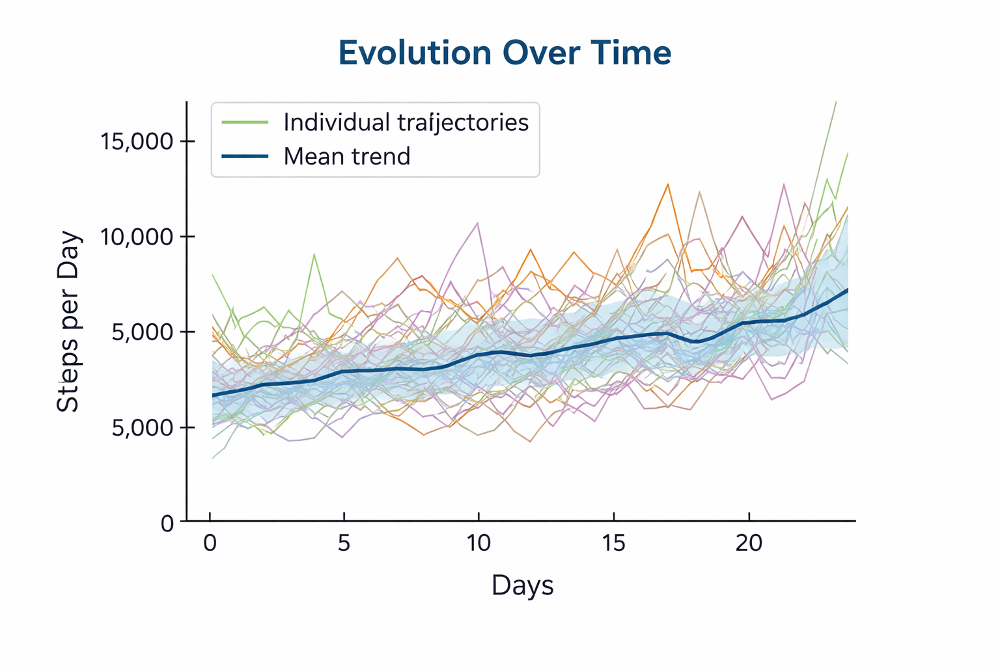
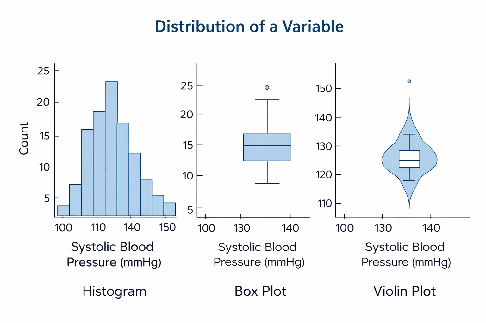
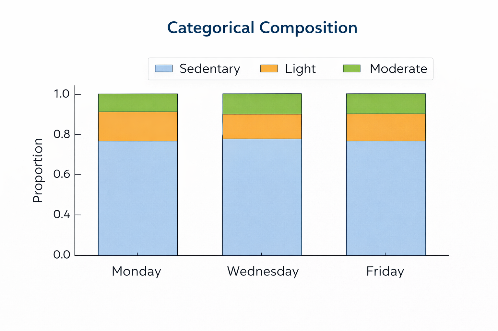
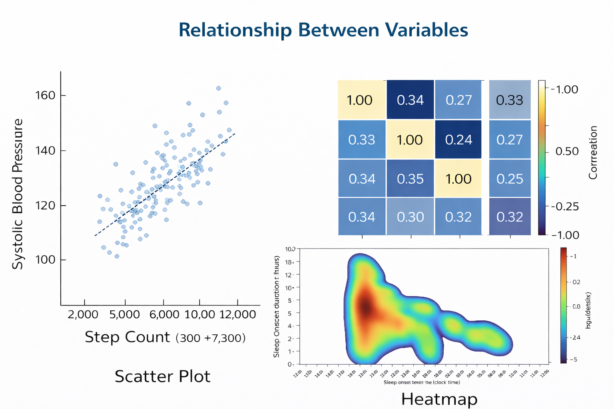

# Build Plots with Python
Visualization is a core component of a robust analytical workflow and should be used throughout the data process to:
- verify structure and detect inconsistencies
- understand distributions and temporal dynamics
- assess assumptions and guide model selection

**Skipping visualization can lead to:**
- undetected data quality issues
- incorrect variable interpretation
- inappropriate modeling strategies

**The objective of this document is to demonstrate how Python can be used to:**
- build plots from structured datasets (pandas)
- handle longitudinal and categorical data
- produce clear scientific visualizations
- scale plotting through automation

**The 3 Fundamental Before Plotting**
Before writing any plotting code, clarify:
- Variable type (numeric vs categorical)
- Time structure (longitudinal vs cross-sectional)
- Objective (distribution, evolution, composition, relationship)


---

## Map of Plot Types
Different analytical objectives require different types of visualizations and choosing the right type is essential before coding.

- Evolution over Time (Longitudinal Data)
line plot, multiple trajectories, mean trend
Used when analyzing repeated measurements over time.



- Distribution of a Variable (histogram, boxplot, violin plot)
Used to understand variability and distribution.



- Categorical Composition (stacked bar chart, proportion plots)
Used to show proportions of categories.



- Relationship Between Variables (scatter plot, heatmap, density plots)
Used to explore associations between variables.



--- 

## Python Libraries for Plotting

Several libraries can be used to create visualizations in Python.

| Library | Description |
|------|------|
| Matplotlib | Core plotting library |
| Seaborn | Statistical visualization built on Matplotlib |
| Plotly | Interactive visualizations |
| Bokeh | Interactive browser-based plotting |
| Altair | Declarative visualization grammar |

In this project we use **Matplotlib**, which is the most fundamental plotting library in Python.

Advantages of Matplotlib:

- very flexible  
- widely used in scientific computing  
- integrates well with pandas  
- suitable for automated pipelines  

---

# Line plot
Multiple Trajectories + Mean Trend

```r
import pandas as pd
import matplotlib.pyplot as plt

# Load data
df = pd.read_excel("steps_data.xlsx")

# Create figure
plt.figure(figsize=(12,7))

# Plot individual trajectories
for pid, g in df.groupby("PID"):
    
    plt.plot(
        g["day_index"],
        g["steps"],
        alpha=0.2
    )

# Compute mean trend
mean_trend = df.groupby("day_index")["steps"].mean()

# Plot mean trend
plt.plot(
    mean_trend.index,
    mean_trend.values,
    linewidth=3,
    label="Mean"
)

# Labels and formatting
plt.xlabel("Day")
plt.ylabel("Steps")
plt.title("Daily Steps — Individual Trajectories + Mean")
plt.legend()

plt.show()

```

## Building a Plot for One Participant
Before automating plot generation, it is important to understand how to build a simple graph.

We start with **a single participant**.

## Import Required Libraries

```r
import pandas as pd
import matplotlib.pyplot as plt
```

- **pandas** manages tabular data and allows manipulation of datasets  
- **matplotlib.pyplot** provides functions used to create plots  

---

# Load the Dataset

```r
df = pd.read_excel("steps_data.xlsx")
```

This command loads the dataset into a **DataFrame**, which is the main table structure used in pandas.

Example structure:

| PID | day_index | steps |
|-----|------|------|
| P01 | 1 | 5200 |
| P01 | 2 | 6100 |

---

# Select One Participant

```r
participant_data = df[df["PID"] == "P01"]
```

This filters the dataset to keep only observations belonging to **participant P01**.
---

# Create the Plot 
1. creates an empty plotting canvas
```r
plt.figure(figsize=(10,6))
# The parameter figsize defines the size of the figure.
```
2. Draw the Trajectory
```r
plt.plot(
    participant_data["day_index"], # x-axis
    participant_data["steps"]  # y-axis
)
```
3. Customize the Plot
```r
plt.xlabel("Day")
plt.ylabel("Steps")
plt.title("Daily Steps — P01")
plt.show()
plt.grid(True)
```
4. Save the Plot
```r
plt.savefig("single_participant_plot.png")
```

# Extending the Plot to Multiple Participants

Once we understand how a single trajectory is plotted, we can extend the graph to multiple participants.

Example: Let's suppose the dataset looks like this:

| PID | day_index | steps |
|-----|----------|------|
| P01 | 1 | 5200 |
| P01 | 2 | 6100 |
| P02 | 1 | 4300 |
| P02 | 2 | 5000 |

1. splits the dataset into smaller subsets based on the participant identifier (`PID`). Each subset corresponds to the data of one participant.

```r
df = pd.read_excel("steps_data.xlsx")
df.groupby("PID")
```

```text
pid = "P01"
g =
PID  day_index  steps
P01      1      5200
P01      2      6100
```

```text
pid = "P02"
g =
PID  day_index  steps
P02      1      4300
P02      2      5000
```
2. Iteration and plotting 
```r
plt.figure(figsize=(12,7))

for pid, g in df.groupby("PID"):

    plt.plot(
        g["day_index"],
        g["steps"],
        alpha=0.2
    )
```
The parameter `alpha=0.2` controls the transparency of the line. Using a low transparency allows many participant trajectories to be displayed simultaneously without making the plot unreadable. 
This allows many trajectories to be visualized simultaneously.

3. Adding a Mean Trend
To better understand the overall population pattern we can compute a mean trajectory.

```r
mean_trend = df.groupby("day_index")["steps"].mean()

plt.plot(
    mean_trend.index,
    mean_trend.values,
    linewidth=3,
    label="Mean Trend"
)
```
**Step 1 — Compute the mean value per day**

```r
mean_trend = df.groupby("day_index")["steps"].mean()
```
For example, if the dataset looks like this:

| PID | day_index | steps |
|-----|----------|------|
| P01 | 1 | 5200 |
| P02 | 1 | 4300 |
| P03 | 1 | 6100 |
| P01 | 2 | 5800 |
| P02 | 2 | 4900 |
| P03 | 2 | 6200 |

Result:

| day_index | mean_steps |
|----------|-----------|
| 1 | 5200 |
| 2 | 5633 |

The object `mean_trend` is therefore a **Series containing the average value for each day**.

**Step 2 — Plot the mean trajectory**

```r
plt.plot(
    mean_trend.index,
    mean_trend.values,
    linewidth=3,
    label="Mean Trend"
)
```
- `mean_trend.index` → represents the **day index** (x-axis)
- `mean_trend.values` → represents the **average number of steps for each day** (y-axis)

Additional parameters:

- `linewidth=3` makes the line thicker so it stands out from the individual trajectories
- `label="Mean Trend"` adds a label that can later appear in the plot legend

### Interpretation

The resulting line represents the **average behavior of the population across time**.

This is useful because:

- individual trajectories can be noisy
- the mean trend highlights the **general pattern shared by participants**
- it helps identify overall increases, decreases, or stable behaviors over time

---


# Distribution of a Variable (histogram, boxplot, violin plot)
Distribution plots are used to understand how a numeric variable is spread.

They help identify:
- variability
- skewness
- outliers

## Histogram
```r
plt.figure()

plt.hist(df["steps"], bins=30)

plt.xlabel("Steps")
plt.ylabel("Frequency")
plt.title("Distribution of Daily Steps")

plt.show()
```

**Add normality curve**

```r
import numpy as np
import matplotlib.pyplot as plt
from scipy.stats import norm

# Extract variable
data = df["steps"].dropna()

# Create figure
plt.figure()

# Histogram (density=True for normalization)
plt.hist(data, bins=5, density=True, alpha=0.6)

# Generate normal curve
x = np.linspace(data.min(), data.max(), 100)
y = norm.pdf(x, mean, std)

# Plot normal curve
plt.plot(x, y, linewidth=2)

# Labels
plt.xlabel("Steps")
plt.ylabel("Density")
plt.title("Steps Distribution with Normal Curve")

plt.show()
```

**Automation Across Variables**
```r
variables = ["steps", "heart_rate", "sleep_duration"]

for var in variables:
    
    plt.figure()
    
    plt.hist(df[var].dropna(), bins=30)
    
    plt.title(f"Distribution of {var}")
    plt.xlabel(var)
    
    plt.show()
```
## Boxplot
```r
plt.figure()

plt.boxplot(df["steps"])

plt.ylabel("Steps")
plt.title("Steps Distribution (Boxplot)")

plt.show()
```


## Violin Plot
```r
import seaborn as sns

plt.figure()

sns.violinplot(y=df["steps"])

plt.ylabel("Steps")
plt.title("Steps Distribution (Violin Plot)")

plt.show()
```

## Stratified Distribution (by Group)

Example: compare distributions across a grouping variable (e.g., sex, site)

**Boxplot by Group**
```r
plt.figure()

df.boxplot(column="steps", by="sex")

plt.title("Steps Distribution by Sex")
plt.suptitle("")  # remove default title
plt.xlabel("Sex")
plt.ylabel("Steps")

plt.show()
```
**Violin Plot by Group**
```r
import seaborn as sns

plt.figure()

sns.violinplot(x="sex", y="steps", data=df)

plt.xlabel("Sex")
plt.ylabel("Steps")
plt.title("Steps Distribution by Sex")

plt.show()
```

---

# Categorical Plots (Bar & Stacked)

Categorical plots are used to summarize counts or proportions of categories.

## Bar Plot (Counts)
Used to quickly assess dominant vs rare categories.
```r
counts = df["activity"].value_counts()

plt.figure()
plt.bar(counts.index, counts.values)

plt.xlabel("Activity")
plt.ylabel("Count")
plt.title("Activity Distribution")

plt.show()
```
**value_counts()** → counts occurrences of each category
each bar → number of observations in that category

## Bar Plot (Proportions)
Allows comparisons across datasets/groups of different sizes
```r
prop = df["activity"].value_counts(normalize=True)

plt.figure()
plt.bar(prop.index, prop.values)

plt.xlabel("Activity")
plt.ylabel("Proportion")
plt.title("Activity Distribution (%)")

plt.show()
```

**normalize=True** → converts counts into proportions
sum of all bars = 1 (or 100%)

## Stacked Plot (Proportions Over Time)
```r
prop = (
    df
    .groupby(["day_index", "activity"])
    .size()
    .groupby(level=0)
    .apply(lambda x: x / x.sum())
    .unstack()
)

prop.plot(kind="bar", stacked=True, figsize=(12,6))

plt.xlabel("Day")
plt.ylabel("Proportion")
plt.title("Activity Composition Over Time")

plt.show()
```

Example Dataset (Sleep Data)

Each row represents the total time spent in a sleep stage for one participant during one night.

| PID | night | sleep_stage | minutes |
| --- | ----- | ----------- | ------- |
| P01 | 1     | REM         | 90      |
| P01 | 1     | Light       | 240     |
| P01 | 1     | Deep        | 70      |
| P02 | 1     | REM         | 80      |
| P02 | 1     | Light       | 260     |
| P02 | 1     | Deep        | 60      |
| P01 | 2     | REM         | 100     |
| P01 | 2     | Light       | 220     |
| P01 | 2     | Deep        | 80      |
| P02 | 2     | REM         | 90      |
| P02 | 2     | Light       | 250     |
| P02 | 2     | Deep        | 70      |

- each participant has multiple nights
- each night is split into sleep stages
- total sleep time = sum of minutes per night

Step 1 — Aggregate at Night Level
```r
df.groupby(["night", "sleep_stage"])["minutes"].sum()
```

Result:

| night | sleep_stage | minutes |
| ----- | ----------- | ------- |
| 1     | REM         | 170     |
| 1     | Light       | 500     |
| 1     | Deep        | 130     |
| 2     | REM         | 190     |
| 2     | Light       | 470     |
| 2     | Deep        | 150     |

We sum across participants to get population-level totals per night

Step 2 — Convert to Proportions
```r
.groupby(level=0).apply(lambda x: x / x.sum())
```

Result:
| night | sleep_stage | proportion |
| ----- | ----------- | ---------- |
| 1     | REM         | 0.21       |
| 1     | Light       | 0.62       |
| 1     | Deep        | 0.16       |
| 2     | REM         | 0.24       |
| 2     | Light       | 0.58       |
| 2     | Deep        | 0.18       |

Each night now sums to 1 (100%)

Step 3 — Reshape for Plotting
```r
.unstack()
```
Result:
| night | REM  | Light | Deep |
| ----- | ---- | ----- | ---- |
| 1     | 0.21 | 0.62  | 0.16 |
| 2     | 0.24 | 0.58  | 0.18 |


**Required structure:**
- rows → nights
- columns → sleep stages
- values → proportions

Step 4 — Plot Interpretation
- Each bar = one night
- total height = 100%
- segments = sleep stage composition


## Stratified Bar Plot
```r
ct = pd.crosstab(df["sex"], df["activity"], normalize="index")

ct.plot(kind="bar", stacked=True)

plt.xlabel("Sex")
plt.ylabel("Proportion")
plt.title("Activity Distribution by Sex")

plt.show()
```
We now want to compare sleep structure between groups, for example:
- male vs female
- different study sites
- age groups

Example Dataset (with Group Variable)
| PID | sex | night | sleep_stage | minutes |
| --- | --- | ----- | ----------- | ------- |
| P01 | M   | 1     | REM         | 90      |
| P01 | M   | 1     | Light       | 240     |
| P01 | M   | 1     | Deep        | 70      |
| P02 | F   | 1     | REM         | 80      |
| P02 | F   | 1     | Light       | 260     |
| P02 | F   | 1     | Deep        | 60      |
| P03 | M   | 2     | REM         | 100     |
| P03 | M   | 2     | Light       | 220     |
| P03 | M   | 2     | Deep        | 80      |
| P04 | F   | 2     | REM         | 90      |
| P04 | F   | 2     | Light       | 250     |
| P04 | F   | 2     | Deep        | 70      |

Step 1 — Aggregate by Group and Category
```r
df.groupby(["sex", "sleep_stage"])["minutes"].sum()
```
Result:
| sex | sleep_stage | minutes |
| --- | ----------- | ------- |
| F   | REM         | 170     |
| F   | Light       | 510     |
| F   | Deep        | 130     |
| M   | REM         | 190     |
| M   | Light       | 460     |
| M   | Deep        | 150     |

Step 2 — Convert to Proportions Within Group
```r
.groupby(level=0).apply(lambda x: x / x.sum())
```
Result:
| sex | sleep_stage | proportion |
| --- | ----------- | ---------- |
| F   | REM         | 0.21       |
| F   | Light       | 0.63       |
| F   | Deep        | 0.16       |
| M   | REM         | 0.24       |
| M   | Light       | 0.57       |
| M   | Deep        | 0.19       |

Step 3 — Reshape for Plotting
```r
.unstack()
```
Result:
| sex | REM  | Light | Deep |
| --- | ---- | ----- | ---- |
| F   | 0.21 | 0.63  | 0.16 |
| M   | 0.24 | 0.57  | 0.19 |

Step 4 — Plot
```r
ct = (
    df
    .groupby(["sex", "sleep_stage"])["minutes"]
    .sum()
    .groupby(level=0)
    .apply(lambda x: x / x.sum())
    .unstack()
)

ct.plot(kind="bar", stacked=True)

plt.xlabel("Sex")
plt.ylabel("Proportion")
plt.title("Sleep Composition by Sex")

plt.show()
```


## Automation Across Variables
```r
cat_vars = ["activity", "sleep_stage"]

for var in cat_vars:
    
    counts = df[var].value_counts()
    
    plt.figure()
    plt.bar(counts.index, counts.values)
    
    plt.title(f"{var} Distribution")
    
    plt.show()
```


# Relationship Between Variables

These plots are used to explore associations between variables.

Scatter Plot
```r
plt.figure()

plt.scatter(
    df["steps"],
    df["sleep_duration"],
    alpha=0.6
)

plt.xlabel("Steps")
plt.ylabel("Sleep Duration")
plt.title("Steps vs Sleep Duration")

plt.grid(True)
plt.show()
```
**Concept**
each point = one observation
x → predictor
y → outcome

**Used to detect:** correlation, trends, outliers

## Scatter Plot with Trend Line
```r
import numpy as np

x = df["steps"]
y = df["sleep_duration"]

coef = np.polyfit(x, y, 1)
trend = np.poly1d(coef)

plt.figure()

plt.scatter(x, y, alpha=0.6)
plt.plot(x, trend(x), linewidth=2)

plt.xlabel("Steps")
plt.ylabel("Sleep Duration")
plt.title("Steps vs Sleep Duration (Trend)")

plt.grid(True)
plt.show()
```

**Concept**
- polyfit → linear regression
- trend line → overall direction

Helps quantify association

## Heatmap (Correlation Matrix)
```r
import seaborn as sns

corr = df[["steps", "heart_rate", "sleep_duration"]].corr()

plt.figure()

sns.heatmap(corr, annot=True)

plt.title("Correlation Matrix")

plt.show()
```
Concept
- correlation matrix → pairwise relationships
- values range from -1 to +1

Used to quickly assess global relationships

## Density Plot (2D)
```r
sns.kdeplot(
    data=df,
    x="steps",
    y="sleep_duration",
    fill=True
)

plt.xlabel("Steps")
plt.ylabel("Sleep Duration")
plt.title("Density Plot")

plt.show()
```
Concept
estimates where points are concentrated
smoother alternative to scatter


